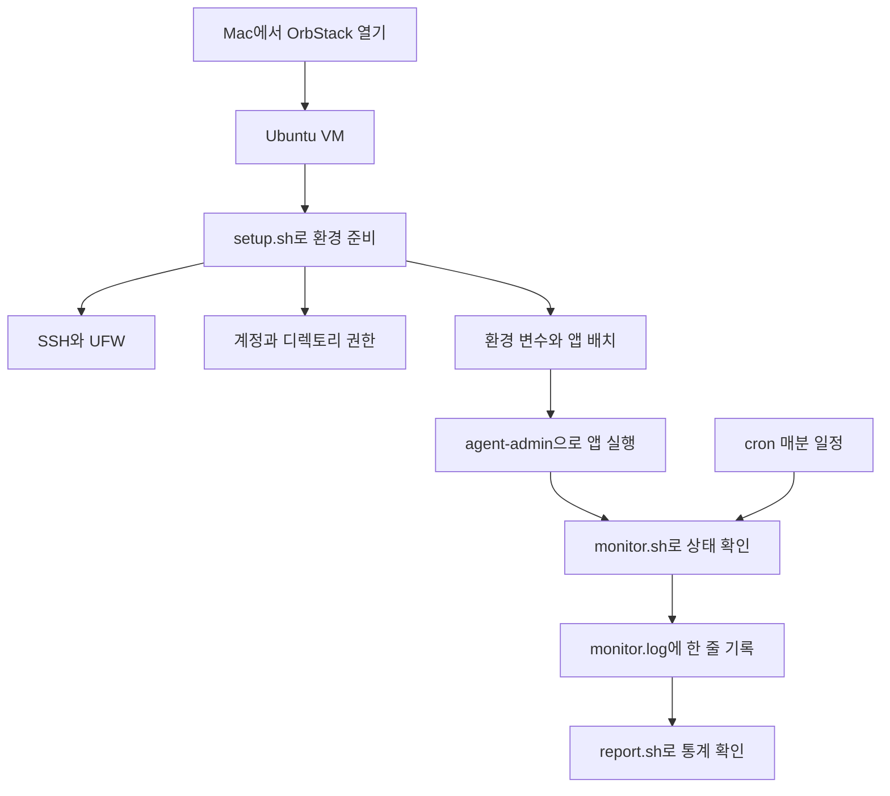

# 처음부터 배우는 리눅스 서버 운영

이 과제의 목표는 명령을 외우는 것이 아니라 **“누가 앱을 실행하고, 누가 어떤 파일을 만질 수 있으며, 앱 상태가 어떻게 기록되는가”를 설명할 수 있게 되는 것**이다.

아무것도 모르는 상태라면 아래 순서로 읽는다. 한 단원은 `목표 → 개념 → 이 과제에서의 사용 → 작은 실습 → 확인 질문`으로 구성했다. 학습 실습 중 ‘설정 변경’이라고 적힌 명령은 VM에 실제 영향을 준다. 단순 읽기·임시 파일 실습과 구분해 표시했다.

## 학습 순서

| 순서 | 단원 | 읽고 나면 할 수 있는 것 |
| --- | --- | --- |
| 1 | [터미널·Linux·파일의 기초](lessons/01-basics.md) | Mac과 VM을 구분하고, 경로를 찾아 파일을 읽고 편집한다 |
| 2 | [서버·프로세스·SSH·방화벽](lessons/02-network.md) | 설정값과 실제 접속 상태의 차이를 설명한다 |
| 3 | [계정·그룹·권한·ACL](lessons/03-permissions.md) | 750·2770을 읽고, 사용자별 접근을 확인한다 |
| 4 | [환경 변수와 앱 실행](lessons/04-application.md) | Boot 검사를 이해하고 올바른 사용자로 앱을 실행한다 |
| 5 | [Bash 문법과 코드 읽기](lessons/05-bash-and-monitor.md) | monitor.sh의 함수와 실행 순서를 따라간다 |
| 6 | [자원 측정·로그·cron·리포트](lessons/06-logs-and-cron.md) | 측정값을 해석하고 자동 실행과 로그 보존을 설명한다 |
| 7 | [검증과 문제 해결](lessons/07-troubleshooting.md) | 오류 메시지에서 원인을 좁히고 제출 증거를 준비한다 |
| 8 | [용어 사전과 복습](lessons/08-glossary.md) | 헷갈리는 용어를 찾아보고 이해도를 점검한다 |

처음에는 1~4장을 읽고 [실행 안내서](../README.md)의 앱·관제 실행을 따라 해 본다. 그다음 5~6장을 읽으며 소스와 로그를 비교한다. 7장은 문제가 생겼을 때, 8장은 용어가 막힐 때 찾아보면 된다. 서두르기보다 작은 실습의 결과를 예상하고 실행해 보자.

## 과제가 연결되는 모습

그림을 한 문장으로 읽으면 “VM을 준비하고 일반 계정으로 앱을 켠 다음, cron이 관제 스크립트를 매분 실행해 로그를 남긴다”이다. Mermaid가 표시되지 않는 뷰어에서는 이 문장과 위의 학습 순서 표를 따라가면 된다.

## 자료를 찾는 방법

| 궁금한 내용 | 볼 곳 |
| --- | --- |
| 지금 무엇을 실행해야 하나? | [루트 README](../README.md) |
| 과제에서 정확히 무엇을 요구하나? | [원본 요구사항](assignment/requirements.md) |
| 이전에 무엇을 했고 결과는 어땠나? | [수행 내역서](submission.md) |
| 실제 출력이나 화면을 보고 싶다 | [검증 증거](evidence/README.md) |
| 어떤 문제를 고쳤나? | [수정 내역](assignment/review_findings.md) |
| 테스트가 어떤 작업을 하나? | [tests 안내](../tests/README.md) |

현재 학습 내용은 최종 코드와 맞췄다. 과거 실패 캡처는 [images/history](images/history/README.md)에 따로 두었으며 현재 성공 증거와 구분한다. 원본 앱의 중복 압축본과 이전 중복 안내 문서는 정리했다. 제공 앱 2종, 원본 과제, 최종 소스, 검증 증거는 보존했다.
