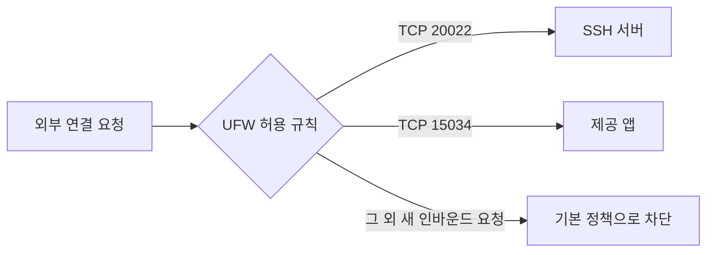
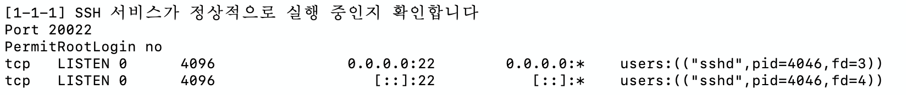

# 2. 서버·프로세스·SSH·방화벽

[이전](01-basics.md) · [목차](../README.md) · [다음: 권한](03-permissions.md)

**목표:** “설정에 20022를 적었다”와 “20022로 접속할 수 있다”가 다른 이유를 설명한다.

## 2.1 서버와 프로세스

서버는 요청을 받아 기능을 제공하는 프로그램이나 그 컴퓨터를 말한다. 파일로 보관된 프로그램을 실행하면 **프로세스**가 된다. 실행된 프로세스에는 PID라는 번호가 붙는다. 같은 앱을 다시 실행하면 PID가 달라질 수 있다.

```bash
ps -eo pid,user,comm | head
```

VM에서 읽기만 하는 명령이다. PID, 실행 사용자, 명령 이름을 보여 준다. 서비스는 보통 계속 실행하면서 기능을 제공하는 프로그램이다. Ubuntu의 `systemd`는 서비스 시작·중지 등을 관리하며, `systemctl`로 제어한다.

| 명령 | 뜻 |
| --- | --- |
| `systemctl status cron --no-pager` | 현재 상태 보기 |
| `sudo systemctl start cron` | 지금 시작 |
| `sudo systemctl stop cron` | 지금 중지 |
| `sudo systemctl restart cron` | 중지 후 다시 시작 |
| `sudo systemctl enable cron` | 다음 부팅부터 시작하도록 등록 |

위 표는 명령의 차이를 배우는 예시다. 현재 과제의 cron을 중지할 필요는 없다. `enable`만으로 항상 지금 시작되는 것은 아니며 `enable --now`는 지금 시작도 함께 요청한다.

## 2.2 IP와 포트

IP 주소는 네트워크에서 통신할 대상을 찾을 때 사용한다. **포트**는 그 대상 안에서 어떤 서비스와 통신할지 구분하는 번호다.

| 값 | 이 과제에서의 의미 |
| --- | --- |
| TCP 20022 | SSH 서버의 접속 포트 |
| TCP 15034 | 제공 앱이 기다리는 포트 |
| `127.0.0.1` | 명령을 실행하는 환경 자기 자신(루프백) |
| `0.0.0.0:15034` | 모든 IPv4 로컬 인터페이스에서 15034로 요청을 받도록 대기 |
| `[::]:20022` | IPv6 모든 로컬 인터페이스에서 20022 대기 |

`0.0.0.0`은 앱의 바인딩 주소다. 다른 컴퓨터에서 접속할 때 그 주소를 목적지로 쓰는 것이 아니라 실제 VM IP나 호스트 이름을 사용한다. 또한 `0.0.0.0`에서 대기해도 방화벽이 막으면 외부에서 접근할 수 없다.

**LISTEN**은 포트를 열고 연결 요청을 기다리는 상태다.

```bash
sudo ss -ltnp 'sport = :15034'
```

`-l`은 LISTEN, `-t`는 TCP, `-n`은 숫자 주소·포트, `-p`는 프로세스 정보를 의미한다. 조건에 맞는 줄이 없으면 앱이 꺼졌거나 다른 포트를 쓰고 있을 수 있다. 포트가 열렸다는 것만으로 앱의 모든 기능이 정상이라는 뜻은 아니다.

## 2.3 SSH는 무엇인가?

SSH는 다른 환경의 셸에 암호화된 연결로 접속하는 방법이다. 접속하는 쪽은 SSH 클라이언트, 기다리는 쪽은 `sshd` 서버다. 기본 포트는 22지만 이 과제는 20022를 요구한다.

접속 명령의 형식:

```text
ssh -p 20022 사용자명@VM주소
```

`사용자명`과 `VM주소`는 실제 값으로 바꾸는 자리다. 이 줄을 그대로 복사하지 않는다. 접속하려면 네트워크뿐 아니라 해당 사용자의 암호 또는 SSH 공개키 설정도 필요하다. 과제 계정 생성만으로 접속 암호가 자동으로 설정되지는 않는다.

현재 저장소의 SSH 검증은 임시 키를 등록해 테스트한 후 제거했다. 따라서 당시 성공 기록이 있다고 해서 지금 개인 SSH 키로 곧바로 로그인할 수 있다고 가정하면 안 된다. OrbStack 내장 Terminal 접근과 VM 내부 `sshd`의 20022 접속도 서로 다른 경로다.

## 2.4 UFW는 무엇인가?

방화벽은 통신을 허용하거나 차단하는 규칙을 적용한다. UFW는 Ubuntu에서 이 규칙을 관리하기 쉽게 해 주는 도구다.



이 과제는 들어오는 통신(incoming)은 기본 차단, 나가는 통신(outgoing)은 허용하고 두 TCP 포트만 예외로 연다. UFW는 연결 상태도 추적하므로 “두 포트만 허용”은 단순히 모든 패킷 중 두 번호 외에는 무조건 버린다는 뜻과는 다르다.

```bash
sudo ufw status verbose
```

`Status: active`, `deny (incoming)`, `allow (outgoing)`, 두 포트의 `ALLOW IN`을 확인한다. `(v6)` 줄은 IPv6용 동일 규칙이다. `ALLOW` 규칙이 있어도 해당 포트에 앱이 없으면 서비스는 사용할 수 없다.

## 2.5 설정 → 상태 → 실제 동작 순서로 확인한다

| 확인 수준 | 명령·검사 | 알 수 있는 것 |
| --- | --- | --- |
| 문법 | `sudo sshd -t` | 설정을 해석할 수 있는지. 정상일 때 출력 없이 종료 가능 |
| 최종 설정 | `sudo sshd -T` | Include 등을 반영한 설정값 |
| 실행 상태 | `sudo ss -ltnp 'sport = :20022'` | 실제 대기 중인지 |
| 실제 동작 | 유효한 자격 증명으로 SSH 로그인 | 네트워크와 인증을 포함해 접속되는지 |

과거 작업에서 실제로 다음 문제가 있었다.



이 화면은 **실패 원인을 공부하는 과거 자료**다. 위의 설정 두 줄은 맞지만 아래 LISTEN 포트는 22다. 현재 성공 증거는 [최종 검증 출력](../evidence/verification.txt)이다.

Ubuntu 24.04에서는 `ssh.socket`이 접속 포트를 먼저 열어 주는 경우가 있다. 이때 ssh 설정 변경을 반영하려면 socket 설정의 재생성이 필요하다. `setup.sh`는 `systemctl daemon-reload`와 활성 socket 재시작을 처리한다. 단순히 설정 파일만 저장하면 끝나는 것이 아니다.

설정을 직접 바꿀 때의 순서는 **새 포트 허용 → 설정 변경 → 문법 검사 → 서비스 반영 → 새 접속 확인 → 불필요한 기존 규칙 정리**다. 이미 정상인 현재 VM에서는 학습을 위해 다시 변경하지 않아도 된다. SSH로 원격 작업 중이라면 기존 연결을 유지하고 OrbStack 콘솔 같은 복구 경로를 확보한 상태에서 바꾼다.

포트를 바꾸면 흔한 기본 포트 접속 시도를 줄일 수 있지만 강한 인증을 대신하지는 않는다. Root 직접 원격 로그인을 막고 일반 계정과 필요한 `sudo` 작업을 구분한다.

## 작은 실습: 세 가지 상태 읽기

**장소: Ubuntu. 영향: 읽기 전용.**

```bash
sudo sshd -T | grep -E '^(port|permitrootlogin) '
sudo ss -ltnp 'sport = :20022'
sudo ufw status verbose
```

각 결과를 보고 “설정 확인”, “실제 대기 상태”, “방화벽 규칙”이라고 이름을 붙여 본다. 기대값은 20022, no, LISTEN, UFW active다.

## 확인 질문

1. UFW에서 15034를 허용했는데 왜 접속이 안 될 수 있는가?
2. Root 로그인이 실패하면 차단 정책을 완전히 증명한 것인가?
3. `enable`과 `start`는 같은 명령인가?

<details>
<summary>답 확인</summary>

1. 앱이 꺼졌거나 다른 주소·포트를 쓰거나 경로·인증 등에 문제가 있을 수 있다.
2. 잘못된 키 때문에 실패했을 수도 있다. 최종 설정과 유효한 인증정보를 이용한 검사 결과를 함께 본다.
3. 아니다. start는 지금 시작, enable은 부팅 시 시작 등록이다.

</details>
