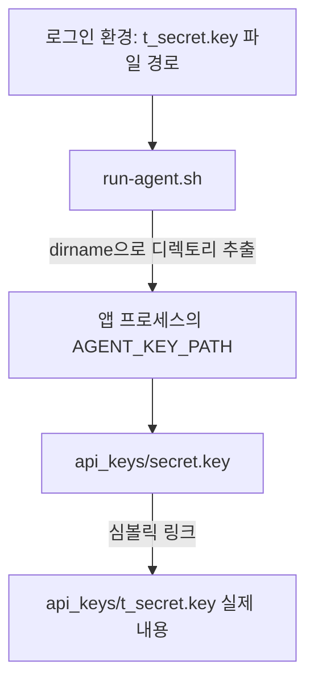

# 4. 환경 변수와 앱 실행

[이전](03-permissions.md) · [목차](../README.md) · [다음: Bash 코드](05-bash-and-monitor.md)

**목표:** 앱을 켜는 데 필요한 사용자·파일·설정·포트를 연결해서 이해한다.

## 4.1 제공 앱과 내가 작성하는 스크립트

과제 문구에는 Python 앱이 나오지만 이 저장소에는 Linux 실행 바이너리 두 개가 제공되어 있다. 바이너리는 이미 실행 가능한 형태로 묶인 프로그램이다. 앱 내부 소스를 새로 만드는 과제가 아니다. 관제·자동화를 Bash로 구현한다.

| VM의 `uname -m` | 제공 파일 |
| --- | --- |
| aarch64 또는 arm64 | agent-app-linux-arm64 |
| x86_64 | agent-app-linux-x86 |

Mac의 CPU가 무엇인지 추측하기보다 **실제 실행할 VM에서** 확인한다. Linux용 실행 파일은 macOS에서 직접 실행하지 않는다. `setup.sh`가 아키텍처를 골라 VM 앱 디렉토리에 배치한다.

설치는 파일과 설정을 준비하는 과정이고, 실행은 프로세스를 켜는 과정이다. 설치가 성공했다고 앱이 저절로 실행되는 것은 아니다.

## 4.2 환경 변수는 프로그램에 전달하는 설정이다

일반 변수는 셸 안에 보관하는 값이다. `export`한 변수는 그 셸이 새로 시작하는 자식 프로그램에도 전달한다.

```bash
LESSON_NAME=agent
printf '%s\n' "$LESSON_NAME"
export LESSON_NAME
bash -c 'printf "%s\n" "$LESSON_NAME"'
unset LESSON_NAME
```

**Ubuntu 일반 계정에서 수행해도 되는 연습**이다. 부모 셸과 자식 Bash 양쪽에서 `agent`가 출력된다. 마지막에 연습 변수를 지운다. 이 변수는 다른 터미널에 자동으로 전달되지 않는다.

현재 앱은 다음 값을 사용한다.

| 변수 | 설명 | 값 |
| --- | --- | --- |
| AGENT_HOME | 앱의 기준 디렉토리 | /home/agent-admin/agent-app |
| AGENT_PORT | 앱의 TCP 포트 | 15034 |
| AGENT_UPLOAD_DIR | 업로드 디렉토리 | /home/agent-admin/agent-app/upload_files |
| AGENT_KEY_PATH | 과제 키 파일 경로 | /home/agent-admin/agent-app/api_keys/t_secret.key |
| AGENT_LOG_DIR | 로그 디렉토리 | /var/log/agent-app |

설정은 `/etc/profile.d/agent_env.sh`에 저장한다. 일반적인 로그인 셸에서는 `/etc/profile`을 통해 이를 읽는다. 모든 프로그램이 자동으로 이 파일을 읽는 것은 아니다. 현재 `run-agent.sh`는 직접 `source`해 필요한 값을 확실히 가져온다.

```bash
sudo -iu agent-admin env | grep '^AGENT_'
```

`-i`는 로그인 환경을 준비하고, `-u`는 실행할 사용자를 지정한다. `env`는 환경 변수를 출력한다. 끝의 grep은 `AGENT_`로 시작하는 줄만 남긴다.

## 4.3 source와 실행의 차이

| 명령 | 동작 |
| --- | --- |
| `bash 설정파일` | 별도 Bash에서 파일을 실행. 그 안의 변수 변경이 부모 셸에 되돌아오지는 않음 |
| `source 설정파일` | 현재 Bash 안에서 파일을 읽음. 변수 변경이 현재 셸에 남음 |
| `export NAME=value` | 현재 셸과 이후 자식 프로그램에 값 전달 |

`source`는 파일을 단순히 읽어 보여 주는 명령이 아니다. 파일 안의 명령을 실행한다. 현재 과제에서는 직접 만든 환경 설정 파일을 읽는 데 사용한다.

환경 파일에 `export AGENT_UPLOAD_DIR="$AGENT_HOME/upload_files"`라고 쓰면 이미 지정된 AGENT_HOME 값 뒤에 `/upload_files`를 붙인다. 변수의 값을 사용할 때는 `$`를 붙이고, 값을 대입할 때는 `AGENT_HOME=...`처럼 `$`를 붙이지 않는다.

## 4.4 키 파일 경로가 두 가지인 이유

원본 요구사항과 제공 바이너리의 기대값이 다르다.

| 구분 | AGENT_KEY_PATH의 뜻 | 읽을 파일 |
| --- | --- | --- |
| 원본 과제 | 키 **파일**의 경로 | api_keys/t_secret.key |
| 제공 바이너리 | 키가 있는 **디렉토리** | 그 디렉토리의 secret.key |

이 차이를 그대로 두면 “파일이 없다”는 Boot 실패가 날 수 있다. 현재는 다음처럼 연결한다.



심볼릭 링크는 다른 경로를 가리키는 작은 파일이다. `secret.key`는 별도 복사본이 아니라 `t_secret.key`를 가리킨다. 따라서 실제 키 내용은 한 곳에 둔다. 테스트 문자열은 `agent_api_key_test` 한 줄이다.

읽기 확인:

```bash
sudo ls -l /home/agent-admin/agent-app/api_keys
sudo -u agent-admin grep -qx 'agent_api_key_test' /home/agent-admin/agent-app/api_keys/t_secret.key
echo $?
```

`-q`는 내용을 출력하지 않고 성공 여부만 반환하고, `-x`는 줄 전체가 일치하는지 확인한다. `0`이면 일치한다. 이 문자열은 과제에서 공개한 테스트 값이며, 실제 서비스 비밀키는 문서나 저장소에 올리지 않는다.

## 4.5 run-agent.sh를 순서대로 읽기

[실제 파일](../../bin/run-agent.sh)은 짧다.

1. Bash의 오류 처리 옵션을 설정한다.
2. 환경 설정 파일을 `source`한다.
3. root 실행이면 거부한다.
4. VM 아키텍처에 맞는 파일을 선택한다.
5. 키의 파일 경로에서 디렉토리를 추출한다.
6. 앱 홈으로 이동한다.
7. `exec`로 셸을 앱 프로세스로 교체한다.

`exec`는 여기서 별도 래퍼 셸을 계속 남겨 두지 않고 앱으로 바꾸는 역할이다. 앱에 전달된 환경 변수 변경이 호출한 부모 터미널의 환경을 바꾸지는 않는다. 따라서 로그인 환경의 키 경로는 과제값을 유지한다.

## 4.6 Boot 5단계 읽기

| 단계 | 검사 목적 | 실패했을 때 먼저 확인할 것 |
| --- | --- | --- |
| 1 사용자 | 일반 계정으로 실행하는가 | whoami, 실행 명령의 사용자 |
| 2 환경 변수 | 필요한 값이 있는가 | AGENT_ 환경 변수와 래퍼 사용 여부 |
| 3 파일 | 키와 내용이 맞는가 | 경로·링크·소유권·내용 |
| 4 포트 | 앱이 사용할 포트가 비어 있는가 | 다른 앱이 이미 15034를 사용하는지 |
| 5 로그 권한 | 로그를 쓸 수 있는가 | 디렉토리·상위 경로·ACL |

Boot의 “포트 사용 가능”은 **앱이 열기 전 비어 있는지**를 확인한다. 관제의 “포트 OK”는 **앱이 연 뒤 LISTEN 중인지**를 확인한다. 서로 반대처럼 보이지만 검사 시점이 다르다.

## 작은 실습: 두 터미널 연결하기

**실제 앱을 시작하는 실습**이다. 기존 앱이 실행 중인지 [실행 안내](../../README.md)에서 먼저 확인한다.

터미널 A, VM 관리 계정:

```bash
sudo -iu agent-admin /home/agent-admin/agent-app/bin/run-agent.sh
```

터미널 B, 같은 VM 관리 계정:

```bash
sudo ss -ltnp 'sport = :15034'
sudo -u agent-admin /home/agent-admin/agent-app/bin/monitor.sh
```

A에서는 Boot와 앱 로그, B에서는 LISTEN과 관제 결과를 볼 수 있어야 한다. A에서 Ctrl+C로 끝낸 후에는 포트 LISTEN이 사라지고 관제가 실패해야 한다. 이 실패 실습을 했다면 A에서 같은 실행 명령으로 앱을 다시 켜 둔다.

VM 재시작 후 cron 서비스가 살아 있어도 앱이 꺼져 있으면 정상 측정 로그는 추가되지 않는다. 앱 자동 부팅 실행은 이번 필수 요구사항에 포함되지 않았다.

## 확인 질문

1. 환경 변수를 export하면 이미 열려 있는 다른 터미널에도 바뀌는가?
2. 왜 제공 바이너리를 직접 실행하기보다 run-agent.sh를 사용하는가?
3. Boot 4단계 성공만으로 최종 LISTEN을 증명할 수 있는가?

<details>
<summary>답 확인</summary>

1. 아니다. 해당 셸이 새로 시작하는 자식 프로세스에 전달된다.
2. 사용자·환경·아키텍처·키 경로의 차이를 일관되게 처리하기 때문이다.
3. 아니다. 앱 준비 후 `ss`에서 LISTEN을 별도로 확인한다.

</details>
