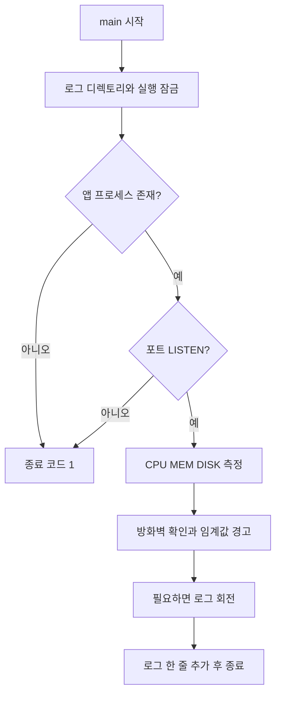

# 5. Bash 문법과 관제 코드 읽기

[이전](04-application.md) · [목차](../README.md) · [다음: 로그와 cron](06-logs-and-cron.md)

**목표:** 코드 전체를 외우지 않고도 “입력 → 검사 → 계산 → 기록”의 흐름을 따라간다. 옆에 [monitor.sh](../../bin/monitor.sh)를 열어 두면 좋다.

## 5.1 스크립트는 명령을 순서대로 적은 파일이다

```bash
#!/usr/bin/env bash
set -euo pipefail
```

첫 줄은 파일을 직접 실행할 때 Bash로 해석하라는 표시다. `bash 파일.sh`처럼 명시해서 실행할 수도 있다. 확장자가 `.sh`라는 이유만으로 모든 셸에서 같은 문법이 동작하는 것은 아니다. 이 과제에서는 `sh` 대신 Bash를 쓴다.

| 설정 | 의미 |
| --- | --- |
| `-e` | 처리하지 않은 명령 실패 시 종료. if/조건문 등에서는 예외가 있어 이것만 믿으면 안 됨 |
| `-u` | 설정되지 않은 변수를 사용하면 오류 |
| `pipefail` | 파이프 앞부분의 실패도 전체 결과에 반영 |
| `LC_ALL=C` | 명령 출력과 소수점 등 로케일 차이를 줄임 |
| `PATH=...` | 명령 실행 파일을 찾을 디렉토리 목록(cron 대비) |

이 옵션들이 모든 오류를 자동 해결해 주는 것은 아니다. 현재 코드는 중요한 검사에서 `check_process || return 1`처럼 실패 처리를 명시한다.

## 5.2 문법을 작은 예로 익히기

다음은 Ubuntu 일반 계정에서 실행할 수 있는 **출력만 하는 연습**이다.

```bash
name='agent admin'
printf 'user: %s\n' "$name"
port="${AGENT_PORT:-15034}"
printf 'port: %s\n' "$port"
```

- `name=값`: 변수에 저장한다. `=` 좌우에 공백을 넣지 않는다.
- `"$name"`: 공백이 있어도 하나의 값으로 전달한다.
- `${AGENT_PORT:-15034}`: 변수가 없거나 비었으면 기본값 15034를 쓴다.
- `printf`의 `%s`: 문자열을 넣을 자리, `\n`: 줄바꿈이다.

```bash
now=$(date '+%H:%M:%S')
bytes=$((10 * 1024 * 1024))
printf '%s / %s bytes\n' "$now" "$bytes"
```

`$(명령)`은 실행 결과를 가져오고, `$((계산식))`은 정수 계산을 한다. 소수점 계산에는 아래에서 설명할 `awk`를 사용한다.

```bash
if [[ "$port" == 15034 ]]; then
  printf 'assignment port\n'
else
  printf 'another port\n'
fi
```

`if`는 조건에 따라 나누는 문장이고 `fi`는 끝을 표시한다. `[[ ... ]]`는 Bash의 조건 검사다. `(( ... ))`는 주로 정수 조건·계산에 사용한다. `case`는 여러 문자열 조건 중 맞는 가지를 선택하며 아키텍처나 실행 파일명 분기에 쓰인다.

## 5.3 종료 코드와 출력 방향

프로그램은 끝날 때 숫자 하나를 돌려준다. 관례상 `0`은 성공, 0이 아닌 값은 실패다.

```bash
false
echo $?
true
echo $?
```

차례대로 1, 0이 나온다. `echo $?`는 마지막 명령의 종료 코드이므로 중간에 다른 명령을 넣으면 보고 싶은 결과가 바뀐다.

| 문법 | 읽는 방법 |
| --- | --- |
| `A && B` | A가 성공하면 B 실행 |
| `A || B` | A가 실패하면 B 실행 |
| `A \| B` | A의 표준 출력을 B의 입력으로 전달 |
| `> file` | 표준 출력으로 파일 덮어쓰기 |
| `>> file` | 표준 출력을 파일 뒤에 추가 |
| `2>/dev/null` | 오류 출력 버리기 |
| `>/dev/null 2>&1` | 일반 출력과 오류 출력을 모두 버리기 |

숫자 1은 표준 출력, 2는 오류 출력을 뜻한다. `/dev/null`은 받은 데이터를 버리는 특수한 대상이다. 운영 로그까지 버린다는 뜻은 아니다. monitor는 스스로 `monitor.log`를 별도로 연다.

`|| true`를 모든 명령 뒤에 붙이면 실제 오류까지 숨길 수 있다. 어떤 실패를 허용하는지 정해서 사용한다.

## 5.4 함수·반복문·배열

```bash
hello() {
  local person="$1"
  printf 'hello %s\n' "$person"
}
hello 'agent'
```

함수는 이름을 붙인 명령 묶음이다. `$1`은 첫 인자이고 `local`은 함수 안에서 사용하는 변수를 만든다. 함수의 `return 1`은 실패를 반환한다. 스크립트 전체를 종료하는 `exit 1`과 적용 범위가 다르다.

```bash
for metric in CPU MEM DISK; do
  printf '%s\n' "$metric"
done
```

반복문은 여러 값이나 파일을 차례로 처리한다. `setup.sh`의 `missing=()`와 `missing+=(값)`은 여러 패키지 이름을 저장하는 배열이다. `monitor.sh`의 로그 회전에서는 `for (( i = MAX_LOG_FILES - 2; i >= 1; i-- ))` 같은 C 스타일 반복문으로 `.8→.9`, `.7→.8` 순서대로 이름을 바꾼다.

## 5.5 main부터 읽으면 전체가 보인다



잠금이 이미 잡혀 있으면 이번 실행은 건너뛰고, 자원 수집 자체가 실패해도 정상 로그를 쓰지 않는다. 그림은 정상 측정으로 이어지는 핵심 흐름이다.

| 함수 | 하는 일 | 확인할 코드 |
| --- | --- | --- |
| check_process | 실행 중인 앱 찾기 | pgrep -o -f, 앵커 정규식 |
| check_port | 지정 TCP 포트의 LISTEN 확인 | ss -Hltn, sport 필터 |
| check_firewall | 활성·비활성·조회 실패 구분 | sudo -n ufw status |
| get_cpu_usage | 1초 전후 CPU 누적값 차이 계산 | /proc/stat, sleep, awk |
| get_mem_usage | 실제 사용률 계산 | free, awk |
| get_disk_usage | 루트 파티션 사용률 | df --output=pcent / |
| print_warning_if_needed | 기준을 넘은 값만 경고 | awk 숫자 비교 |
| rotate_logs_if_needed | 다음 줄이 한도를 넘기 전 회전 | stat, mv |
| main | 위 과정을 순서대로 연결 | flock, 검사, printf |

파일 마지막의 `if [[ ${BASH_SOURCE[0]} == "$0" ]]`는 직접 실행할 때만 main을 부른다. 테스트에서 `source`할 때는 함수만 불러오므로 개별 함수를 검사할 수 있다.

## 5.6 프로세스를 찾을 때 주의할 점

`pgrep -f 문자열`은 전체 명령줄에서 문자열을 찾는다. 예를 들어 앱 파일명을 인자로 가진 `sudo`나 `vim` 명령까지 앱이라고 잘못 고를 수 있다.

현재 코드는 정규식의 맨 앞을 `^([^ ]*/)?`로 고정해 **명령줄의 첫 단어(실행 파일 경로)**가 제공 앱 바이너리이거나 `python ... agent_app.py`인 경우만 찾는다. 이렇게 하면 `sudo -u agent-admin .../agent-app-linux-arm64` 같은 부모 명령이나 편집기 명령은 첫 단어가 `sudo`, `vim`이므로 매칭되지 않는다.

또한 `/proc/PID/exe`는 같은 사용자라도 보안 정책(ptrace 등) 때문에 읽지 못하는 경우가 있어 사용하지 않는다.

## 5.7 awk는 표 형태의 텍스트를 계산한다

```bash
printf 'CPU 12.5\n' | awk '{print $1, $2 * 2}'
```

결과는 `CPU 25`다. awk에서 `$1`, `$2`는 입력 줄의 첫 번째·두 번째 필드다. Bash의 함수 인자 `$1`과 생김새는 같지만 **어느 언어 안에서 해석되는지**에 따라 의미가 다르다. 작은따옴표 안의 awk 코드는 Bash가 `$1`을 먼저 바꾸지 않게 해 준다.

`BEGIN`은 입력 전, 일반 규칙은 각 줄에서, `END`는 모든 입력을 읽은 후에 실행된다. `monitor.sh`에서는 CPU 비율 계산과 임계값(소수점) 비교에서 `awk`를 사용한다. (Bash 자체는 정수 계산만 지원하고 소수점 비교를 못 하기 때문이다)

## 5.8 설치 코드도 함께 읽기

[setup.sh](../../bin/setup.sh)는 시스템 설정을 실제로 바꾸므로 실행보다 읽기부터 한다.

- `SCRIPT_DIR` 대신 `dirname "$0"`으로 스크립트 위치를 간단히 구한다.
- `install -o ... -g ... -m ...`은 파일 복사와 소유권·권한 지정을 한 번에 처리한다.
- `setfacl --set`은 access ACL과 default ACL을 한 번에 정의해 하위 파일/디렉토리까지 권한을 상속시킨다.
- `<<'EOF'` 같은 here-document는 여러 줄을 파일에 쓴다. 구분자에 따옴표가 있으면 작성 시점에 환경 변수가 미리 치환되지 않는다.

추가로 심볼릭 링크를 따라 실제 스크립트 위치를 찾는 방법은 [선택 예제](../examples/dirname_resolve.sh)에 보존했다. 이 예제는 앱 설치에 필요한 파일은 아니다.

## 작은 실습: 수정하지 않고 코드 확인

**Ubuntu VM에서 소스 문법만 검사한다. 시스템 설정을 실행하지 않는다.**

```bash
bash -n /Users/hankkim/Desktop/codyssey/B4-1/bin/monitor.sh
echo $?
```

출력 없이 0이면 Bash 문법을 해석할 수 있다는 뜻이다. 실제 앱 탐지·권한·로그 기록 성공은 실행 검증이 따로 필요하다.

## 확인 질문

1. `bash -n` 성공이 실제 관제 성공까지 보장하는가?
2. `${AGENT_PORT:-15034}`는 무엇인가?
3. CPU 경고가 나왔을 때 return 1로 종료해야 하는가?

<details>
<summary>답 확인</summary>

1. 아니다. 문법만 검사한다.
2. 환경 변수 값이 없거나 비었을 때 기본값 15034를 쓰는 표현이다.
3. 아니다. 과제에서 자원 초과는 경고 후 기록을 계속하라고 요구한다.

</details>
