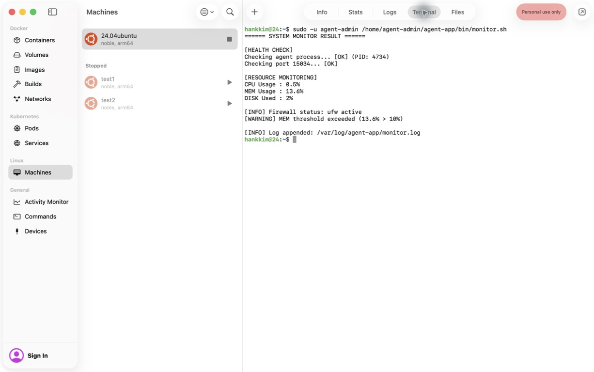

# 리눅스 서버 운영 미션 수행 내역서

2026-09-06에 OrbStack `24.04ubuntu`(Ubuntu 24.04.4 LTS, aarch64)에서 설치·수정·검증했고, 2026-10-08에 스크립트를 간소화한 뒤 같은 VM에서 재설치하여 전체 테스트를 다시 통과했다. 원본 과제의 Ubuntu 22.04 또는 동등 Linux 환경 조건에 따라 Ubuntu 24.04를 사용했다. 필수 소스는 [bin/monitor.sh](../bin/monitor.sh)이며, 본 문서와 [실제 실행 증거](evidence/)를 함께 제출한다.

## 1. 요구사항과 검증 결과

| 요구사항 | 적용 내용 및 결과 | 실제 증거 |
| --- | --- | --- |
| SSH 20022, Root 원격 로그인 차단 | `port 20022`, `permitrootlogin no`, 22 LISTEN 없음. 같은 임시 키로 일반 계정 로그인 성공·Root 거부 확인 | [설정·LISTEN](evidence/verification.txt), [로그인 검사](evidence/ssh-login.txt) |
| 방화벽 | UFW active, 인바운드 차단, TCP 20022·15034만 허용(IPv4/IPv6) | [종합 검증](evidence/verification.txt) |
| 계정·그룹 | common: admin/dev/test, core: admin/dev | [id·getent](evidence/verification.txt) |
| 디렉토리·ACL | upload는 common R/W, 키·로그는 core R/W. test의 키·로그 접근 거부 및 신규 업로드 파일의 ACL 상속 검증 | [권한·실제 파일 검사](evidence/verification.txt) |
| 환경 변수·키 | 과제의 `t_secret.key` 파일 경로와 테스트 문자열 적용. 바이너리 차이는 실행 래퍼에서 처리 | [환경 변수·키 검사](evidence/verification.txt) |
| 앱 | 일반 계정, Boot 5단계 OK, Agent READY, `0.0.0.0:15034` LISTEN | [Boot](evidence/boot.txt), [ss 출력](evidence/verification.txt) |
| monitor.sh | agent-dev:agent-core, 750. 프로세스·포트·시스템 자원 확인과 로그 기록 | [관제 출력](evidence/monitor.txt) |
| 실패·경고 | 앱 종료/닫힌 포트는 exit 1. 자원 초과는 WARNING 후 계속 기록 | [실패 검사](evidence/failure-cases.txt), [경계값 검사](evidence/regression.txt) |
| 로그 관리 | 10MiB 초과 전에 회전, 현재 로그 포함 총 10개, 동시 실행은 flock으로 제어 | [실제 크기 회전 검사](evidence/regression.txt) |
| cron | agent-admin의 crontab에 매분 등록, 수동 실행 없는 비교 구간에서 로그 증가 | [이전](evidence/cron-before.txt), [이후·cron 기록](evidence/cron-after.txt) |

보너스 1(report.sh 통계)과 보너스 2(7일 압축·30일 삭제)는 선택하지 않았다. 필수인 크기 기반 로그 회전은 구현·검증했다. 검증 대상은 ARM64 제공 앱이며 x86 바이너리의 실행은 별도로 검증하지 않았다.

## 2. 설정 및 명령어 기록

### 설치

Mac의 저장소는 OrbStack VM에 공유된다. 아래 명령은 **Ubuntu VM 안에서** 실행한다.

```bash
sudo bash /Users/hankkim/Desktop/codyssey/B4-1/bin/setup.sh
```

[setup.sh](../bin/setup.sh)는 다음 작업을 수행한다. 다른 작업 디렉토리에서 재실행하여 원본 앱이 보존되고 설정이 유지되는 것도 확인했다([초기 적용](evidence/setup.txt), [재실행](evidence/setup-rerun.txt)).

- SSH 설정을 검증한 뒤 재시작한다. Ubuntu 24.04의 `ssh.socket`도 반영한다.
- UFW 규칙을 초기화(`ufw --force reset`)한 뒤 인바운드 기본 차단, TCP 20022·15034만 허용하고 활성화한다.
- 계정·그룹과 디렉토리를 생성하고, `/home/agent-admin`에는 common의 통과 권한만 추가한다. 공유·보안 디렉토리의 ACL은 `setfacl --set` 한 번으로 access/default를 함께 지정한다.
- CPU 종류에 맞는 바이너리와 스크립트를 `install`로 복사하면서 소유권과 실행 권한을 지정한다.
- `agent-admin`에 `/usr/sbin/ufw status` 조회 하나만 비밀번호 없이 허용한다. 관제 전체를 root로 실행하지 않는다.
- `agent-admin`의 기존 crontab은 보존하면서, 관제 스크립트만 중복 없이 등록/갱신한다.

### 디렉토리와 권한

| 경로 | 소유자:그룹 | 모드 |
| --- | --- | --- |
| `/home/agent-admin/agent-app` | agent-admin:agent-common | 750 |
| `upload_files` | agent-admin:agent-common | 2770 + access/default ACL |
| `api_keys` | agent-admin:agent-core | 2770 + access/default ACL |
| `/var/log/agent-app` | agent-admin:agent-core | 2770 + access/default ACL |
| `bin` | agent-dev:agent-core | 750 |
| `bin/monitor.sh` | agent-dev:agent-core | 750 |
| `api_keys/t_secret.key` | agent-admin:agent-core | 660 |

디렉토리의 setgid는 신규 파일의 그룹을 이어받게 한다. default ACL은 일반적인 파일 생성 시 그룹의 읽기·쓰기를 유지한다. 프로그램이 명시적으로 600으로 만드는 파일까지 강제로 공유 권한을 부여하는 것은 아니다.

### 환경 변수와 제공 앱의 차이

`/etc/profile.d/agent_env.sh`:

```bash
export AGENT_HOME=/home/agent-admin/agent-app
export AGENT_PORT=15034
export AGENT_UPLOAD_DIR="$AGENT_HOME/upload_files"
export AGENT_KEY_PATH="$AGENT_HOME/api_keys/t_secret.key"
export AGENT_LOG_DIR=/var/log/agent-app
```

과제는 `AGENT_KEY_PATH`를 파일 경로로 지정하지만 제공 바이너리는 디렉토리를 받아 그 아래의 `secret.key`를 찾는다. 두 조건을 함께 지원하기 위해:

1. 실제 키는 과제대로 `t_secret.key`에 한 줄로 저장한다.
2. 같은 디렉토리에 `secret.key -> t_secret.key` 심볼릭 링크를 만든다.
3. [run-agent.sh](../bin/run-agent.sh)가 **앱 프로세스에만** `AGENT_KEY_PATH`의 디렉토리를 전달한다. 로그인 환경 변수는 과제의 파일 경로를 유지한다.

이는 제공 바이너리 호환 처리이며 바이너리 자체는 수정하지 않았다. 원문과 다른 앱 내부 환경 값은 숨기지 않고 이 문서에 명시했다.

### 실행 및 종료

일반 계정의 터미널에서 다음과 같이 실행한다. 이미 앱이 실행 중이면 두 번째 앱을 실행하지 않는다.

```bash
sudo -iu agent-admin
/home/agent-admin/agent-app/bin/run-agent.sh
# 종료: Ctrl+C
```

이번 검증에서는 터미널과 독립적으로 앱을 유지하기 위해 임시 systemd 서비스 `agent-assignment`를 사용했다. 서비스의 실행 계정은 `agent-admin`이며 검증 종료 시점에는 VM에서 실행 중이었다. 현재 상태는 `systemctl status agent-assignment`로 다시 확인한다. 앱을 멈추려면 `sudo systemctl stop agent-assignment`를 사용한다(SIGINT 전달). 이 임시 서비스는 재부팅 후 자동 시작하지 않으며, VM 재시작 후에는 위의 일반 계정 실행 명령으로 앱을 켜면 된다. cron은 앱이 실행 중일 때만 정상 로그를 추가한다.

### 관제와 cron

```bash
sudo -u agent-admin /home/agent-admin/agent-app/bin/monitor.sh
sudo -u agent-admin tail -n 5 /var/log/agent-app/monitor.log
sudo -u agent-admin crontab -l
```

등록한 crontab:

```cron
* * * * * /home/agent-admin/agent-app/bin/monitor.sh >/dev/null 2>&1
```

실제 비교 구간은 2026-09-06 22:04:03 → 22:05:24(KST)이며, 수동 관제 실행 없이 로그가 6줄 → 7줄로 증가했다. 추가된 줄은 22:05:03이고 cron 실행 기록은 22:05:01이다.

관제는 로그 경로와 포트의 기본값을 자체 설정하므로 로그인 셸의 환경 변수에 의존하지 않는다. 표준 출력은 수동 실행에서 확인하고 cron 수행 이력은 `journalctl -u cron`에서 확인한다. 측정 로그는 스크립트가 직접 `monitor.log`에 기록한다.

앱 프로세스는 `pgrep -f`에 명령줄 맨 앞(`^`)을 고정한 정규식을 써서, 실행 파일 자체가 제공 앱(또는 `python ... agent_app.py`)인 프로세스만 찾는다. CPU는 `/proc/stat`의 1초 차이로 측정한다. 메모리는 `free`의 `(total - available) / total`, 디스크는 루트 파티션 `df /`의 사용률이다. 기준은 CPU > 20%, MEM > 10%, DISK > 80%이며 경계값과 같은 경우 경고하지 않는다.

```text
[YYYY-MM-DD HH:MM:SS] PID:... CPU:..% MEM:..% DISK_USED:..%
```

로그 회전은 현재 파일 + `.1`부터 `.9`까지 총 10개다. `flock`으로 측정·회전·기록을 한 실행만 수행한다. 과제의 10MB는 10 × 1024 × 1024 바이트로 구현했다.

## 3. 검증 방법

[tests](../tests/)의 Bash 스크립트는 다음을 검증한다.

- `verify_vm.sh`: 실제 SSH/UFW·계정·ACL·환경 변수·앱·관제 검사(root).
- `verify_ssh.sh`: 유효한 임시 키로 일반 계정 로그인 및 root 차단, 검사 후 키 제거(root).
- `verify_failures.sh`: 닫힌 포트와 실제 앱 종료 시 exit 1, 종료 후 앱 복원(root).
- `test_monitor.sh`: Linux 자원 수집, 실제 10MiB 로그 회전, 경계값, 프로세스 탐지 정규식. 방화벽의 비활성/조회 실패 분기는 명령 응답을 대체한 검사다.

시스템 설정과 앱 실행을 검증하는 테스트는 Ubuntu 과제 VM에서 실행한다. 최종 결과는 [검증 기록](evidence/verification.txt)에 보관했다. [배치 무결성 검사](evidence/deployment.txt)에서 VM 스크립트와 저장소 소스가 같고 원본 바이너리가 보존됨을 확인했다.

## 4. OrbStack 화면 확인

컴퓨터 제어 도구로 OrbStack에서 VM을 시작하고, 내장 Terminal에서 `agent-admin` 권한으로 관제를 직접 실행했다. 프로세스·포트 OK, UFW active, 메모리 임계값 경고 후 로그 기록을 확인했다. 메모리 WARNING은 과제에서 요구한 동작이며 실패가 아니다.



## 5. 수정한 문제

앱 파일명 불일치, 작업 디렉토리에 의존하는 배치, 재실행 시 원본 이동 문제, 상위 홈 디렉토리 통과 권한 누락, 방화벽 조회 실패 오판, 총 11개 로그 보관 문제, 리소스 수집과 출력 문제를 수정했다. VM에서 추가 발견된 `/proc/PID/exe` 접근 제한은 명령줄 맨 앞을 비교하는 방식으로 해결했다(2026-10-08 간소화 이후에는 앵커를 건 `pgrep -f` 정규식). 자세한 내역은 [수정 결과](assignment/review_findings.md)를 참고한다.
